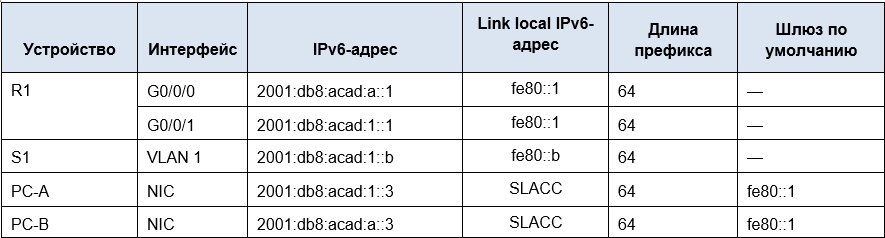

# Занятие 10 Лабораторная работа. Настройка IPv6-адресов на сетевых устройствах 

### Топология:

### Таблица адресации

## Задачи
* Часть 1. Настройка топологии и конфигурация основных параметров маршрутизатора и коммутатора
* Часть 2. Ручная настройка IPv6-адресов
* Часть 3. Проверка сквозного соединения
