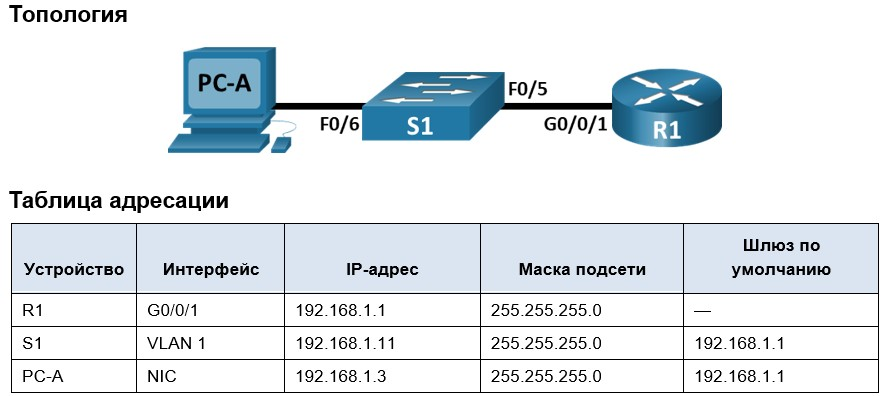

# Лабораторная работа. Доступ к сетевым устройствам по протоколу SSH
## 	Задачи
### Часть 1. Настройка основных параметров устройства
### Часть 2. Настройка маршрутизатора для доступа по протоколу SSH
### Часть 3. Настройка коммутатора для доступа по протоколу SSH
### Часть 4. SSH через интерфейс командной строки (CLI) коммутатора
#####

### Часть 1. Настройка основных параметров устройств
#### ШАГ 1. Создание сети согласно топологии
#### ШАГ 2. Выполнение инициализации устройств
#### ШАГ 3. Настройка маршрутизатора:
#### [Выполнение комманд.](CommR1)
#### [Итоговая конфигурация R1.](ConfR1)
#### ШАГ 4. Настройка компьютера PC-A.
##### [Вполнение комманды ipconfig](ConfPCA)
#### ШАГ 5. Проверка подключения к сети.
##### [Выполнение комманды ping на PCA](ping1)
### Часть 2. Настройка маршрутизатора для доступа по протоколу SSH
#### [ШАГ 1-5 Выполнение комманд.](CommR2)
#### ШАГ 6. Установка соединения с маршрутизатором по протоколу SSH
##### [Выполнение комманды на PCA](provSSSH1)
### Часть 3. Настройка коммутатора для доступа по протоколу SSH
#### [ШАГ 1-2 Выполнение комманд.](CommS1)
#### [Итоговая конфигурация S1.](ConfS1)
#### ШАГ 3. Установка соединения с коммутатором по протоколу SSH
##### [Выполнение комманды на PCA](provSSH2)
### Часть 4. Настройка протокола SSH с использованием интерфейса командной строки (CLI) коммутатора
#### ШАГ 1. Доступные парметры клиента SSH  в Cisco IOS на коммутаторе S1
##### Выполнение команды S1#ssh ?
######    -l  Log in using this user name
######    -v  Specify SSH Protocol Version 
#### Шаг 2. Установка с коммутатора S1 соединение с маршрутизатором R1 по протоколу SSH.
##### S1#ssh -l admin 192.168.1.1
###### Password: 
###### Unauthorized access is strictly prohibited. 
###### R1>
