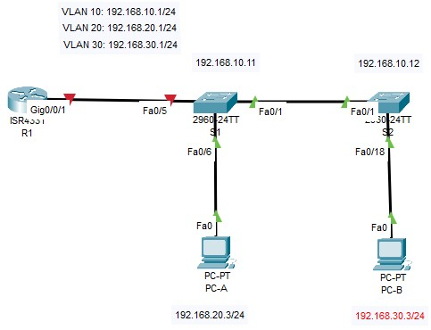
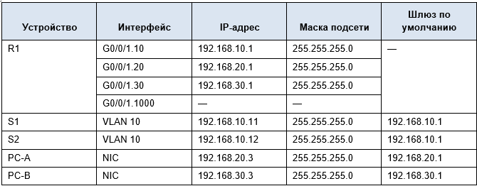
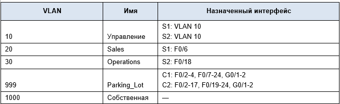

# Лабораторная работа - Внедрение маршрутизации между виртуальными локальными сетями
## Топология

## Таблица адресации

## Таблица VLAN

## Задачи
### Часть 1. Создание сети и настройка основных параметров устройства
### Часть 2. Создание сетей VLAN и назначение портов коммутатора
### Часть 3. Настройка транка 802.1Q между коммутаторами.
### Часть 4. Настройка маршрутизации между сетями VLAN
### Часть 5. Проверка, что маршрутизация между VLAN работает
## Часть 1. Создание сети и настройка основных параметров устройства
### ШАГ 1. Создайте сеть согласно топологии

### Шаг 2. Настройте базовые параметры для маршрутизатора.
#### [Выполнение комманд.](CommR1)
### Шаг 3. Настройте базовые параметры каждого коммутатора.
#### [Выполнение комманд для S1.](CommS1)
#### [Выполнение комманд для S2.](CommS2)
### Шаг 4. Настройте узлы ПК.
#### Настройка IP-адреса и DGW на ПК согласно таблице адресации
## Часть 2. Создание сетей VLAN и назначение портов коммутатора
### Шаг 1. Создайте сети VLAN на коммутаторах.
#### [Выполнение комманд на S1.](CommS12)
#### [Выполнение комманд на S2.](CommS22)
### Шаг 2. Назначьте сети VLAN соответствующим интерфейсам коммутатора.
#### Выполнение команд на S1:
##### S1(config)#int f0/6
##### S1(config-if)#switchport mode access 
##### S1(config-if)#switchport acc vlan 20
##### S1(config-if)#do wr
#### Выполнение команд на S2:
##### S2(config-if-range)#int f0/18
##### S2(config-if)#sw mo acc
##### S2(config-if)#sw acc vlan 30
##### S2(config-if)#do wr
## Часть 3. Конфигурация магистрального канала стандарта 802.1Q между коммутаторами
### Шаг 1. Вручную настройте магистральный интерфейс F0/1 на коммутаторах S1 и S2.
#### [Настройки trunk для S1](CommS13)
#### [Настройки trunk для S2](CommS23)
#### [Поверка командой sh vlan br на S1](S1shvlanbr1)
#### [Поверка командой sh int f0/1 sw на S1](S1shinsw1)
#### [Поверка командой sh vlan br на S2](S2shvlanbr1)
#### [Поверка командой sh int f0/1 sw на S2](S2shinsw1)
### Шаг 2. Вручную настройте магистральный интерфейс F0/5 на коммутаторе S1.
#### Выполнение команд:
##### S1(config)#int f0/5
##### S1(config-if)#sw mo tr
##### S1(config-if)#sw tr allowed vlan 10,20,30
##### S1(config-if)#sw tr native vlan 1000
#### [Поверка командой sh int f0/5 sw на S1](S1shinsw2)
## Часть 4. Настройка маршрутизации между сетями VLAN
### Шаг 1. Настройте маршрутизатор.
#### Настройка подинтерфейсов на маршрутизаторе R1 для каждого VLAN, инкапсуляция 802.1Q, включение интерфейса G0/0/1
#### [Выполнение команд на R1](CommR12)
