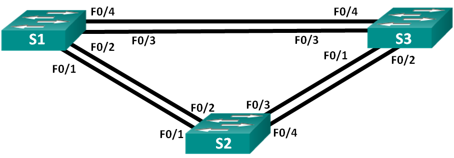
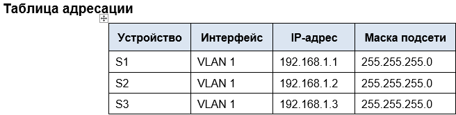
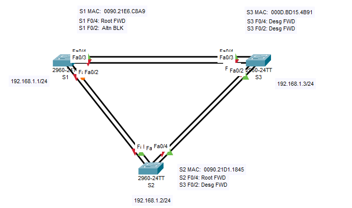

# Лабораторная работа. Развертывание коммутируемой сети с резервными каналами

## Цели
### Часть 1. Создание сети и настройка основных параметров устройства
### Часть 2. Выбор корневого моста
### Часть 3. Наблюдение за процессом выбора протоколом STP порта, исходя из стоимости портов
### Часть 4. Наблюдение за процессом выбора протоколом STP порта, исходя из приоритета портов
## Часть 1. Создание сети и настройка основных параметров устройства
### Шаг 1:	Создайте сеть согласно топологии.
### Шаг 2:	Выполните инициализацию и перезагрузку коммутаторов.
### Шаг 3:	Настройте базовые параметры каждого коммутатора.
#### [Базовая настройка коммутатора S1, выполнение комманд.](InnS11)
#### [Базовая настройка коммутатора S2, выполнение комманд.](InnS21)
#### [Базовая настройка коммутатора S3, выполнение комманд.](InnS31)
### Шаг 4:	Проверьте связь.
##### Проверьте способность компьютеров обмениваться эхо-запросами.
##### Успешно ли выполняется эхо-запрос от коммутатора S1 на коммутатор S2?	Выполняется.
##### Успешно ли выполняется эхо-запрос от коммутатора S1 на коммутатор S3?	Выполняется.
##### Успешно ли выполняется эхо-запрос от коммутатора S2 на коммутатор S3?	Выполняется.
## Часть 2:	Определение корневого моста
### Шаг 1:	Отключите все порты на коммутаторах.
#### Выполнение комманд на всех коммутаторах:
##### int range f0/1-4
##### sh
### Шаг 2:	Настройте подключенные порты в качестве транковых.
#### Выполнение комманд на всех коммутаторах:
##### int range f0/1-4
##### sw mo tr
### Шаг 3:	Включите порты F0/2 и F0/4 на всех коммутаторах.
#### Выполнение комманд на всех коммутаторах:
##### int range f0/2, f0/4
##### no sh
### Шаг 4:	Отобразите данные протокола spanning-tree.
#### Результаты выполнения команды sh spanning-tree для каждого из коммутаторов:
#### [Для S1](ShowSTPS11)
#### [Для S2](ShowSTPS21)
#### [Для S3](ShowSTPS31)

##### Какой коммутатор является корневым мостом? Коммутатор S3.
##### Почему этот коммутатор был выбран протоколом spanning-tree в качестве корневого моста? Приоритеты у всех коммутаторов одинаковые. MAC адрес у S3 наименьший.
##### Какие порты на коммутаторе являются корневыми портами? Порты, которые "смотрят" на корневой коммутатор.
##### Какие порты на коммутаторе являются назначенными портами? Которые не заблокированы.
##### Какой порт отображается в качестве альтернативного и в настоящее время заблокирован? Порт F0/2 на коммутаторе S1.
##### Почему протокол spanning-tree выбрал этот порт в качестве невыделенного (заблокированного) порта? В текущей топологии только один из коммутаторов S1 или S2 может содержать заблокированный порт. BID на всех коммутаторах одинаковые. Сравниваются MAC адреса, на S1 самое большое значение MAC адреса-порт F0/2 блокируется на его стороне.
## Часть 3:	Наблюдение за процессом выбора протоколом STP порта, исходя из стоимости портов
### Шаг 1:	Определите коммутатор с заблокированным портом.
#### Коммутатор S1 с заблокированным портом F0/2.
### Шаг 2:	Измените стоимость порта.
#### Выполнение команд на S1:
##### S1(config)#int f0/4
#####S1(config-if)#spanning-tree vlan 1 cost 18
