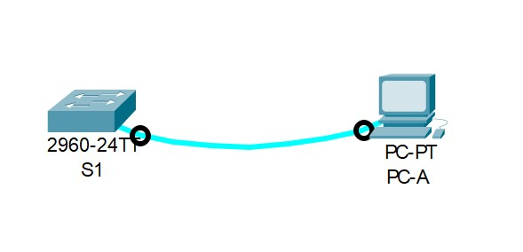

# Занятие 2: Команды IOS. Базовая конфигурация устройств
## Задачи
#### Часть 1. Проверка конфигурации коммутатора по умолчанию
#### Часть 2. Создание сети и настройка основных параметров устройства
Настройте базовые параметры коммутатора.
Настройте IP-адрес для ПК.
#### Часть 3. Проверка сетевых подключений
Отобразите конфигурацию устройства.
Протестируйте сквозное соединение, отправив эхо-запрос.
Протестируйте возможности удаленного управления с помощью Telnet.

### Часть 1 Проверка конфигурации коммутатора по умолчанию
##### Топология 1:

[1 Настройки коммутатора по умолчанию](LABS/ДЗ Занятие 2/def1)
