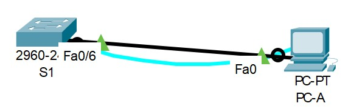

# Занятие 2: Команды IOS. Базовая конфигурация устройств
## Задачи
#### Часть 1. Проверка конфигурации коммутатора по умолчанию
#### Часть 2. Создание сети и настройка основных параметров устройства
Настройте базовые параметры коммутатора.

Настройте IP-адрес для ПК.
#### Часть 3. Проверка сетевых подключений
Отобразите конфигурацию устройства.

Протестируйте сквозное соединение, отправив эхо-запрос.

Протестируйте возможности удаленного управления с помощью Telnet.

### Часть 1 Проверка конфигурации коммутатора по умолчанию
##### Топология 1:

#### [1 Настройки коммутатора по умолчанию](def1)
**24 порта FastEthernet**

**2 порта GigabitEthernet**

**Диапазоны vty: 0-4 и 5-15**

**Т.к. еще не сохранен running config:**

Switch# sh startup-config 

startup-config is not present

**SVI для VLAN1 не настроен:**

interface Vlan1

no ip address

shutdown

version 15.0 – Версия ОС
##### Топология 2:

#### [Подключение к инт. fa06](Podc fa06)
