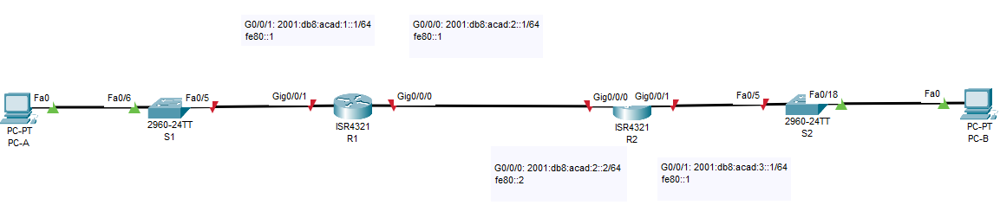
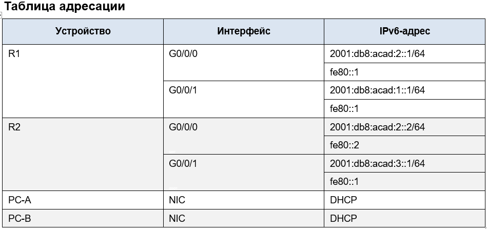

## Лабраторная работа - Настройка DHCPv6 
### Топология

## Задачи
### Часть 1. Создание сети и настройка основных параметров устройства
### Часть 2. Проверка назначения адреса SLAAC от R1
### Часть 3. Настройка и проверка сервера DHCPv6 без гражданства на R1
### Часть 4. Настройка и проверка состояния DHCPv6 сервера на R1
### Часть 5. Настройка и проверка DHCPv6 Relay на R2
