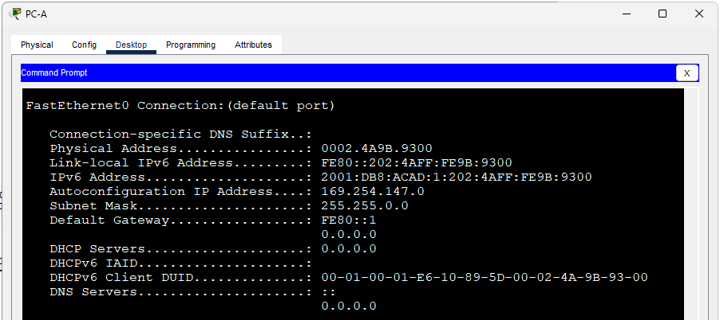
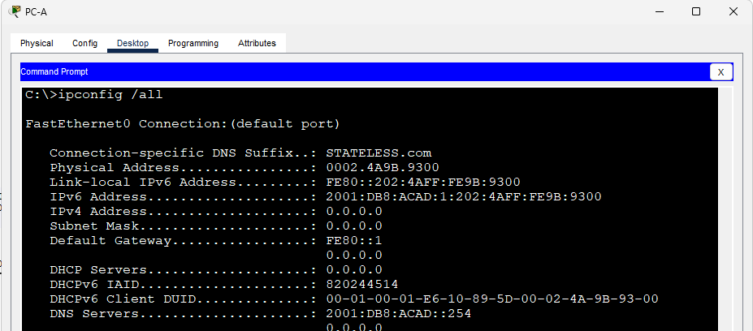
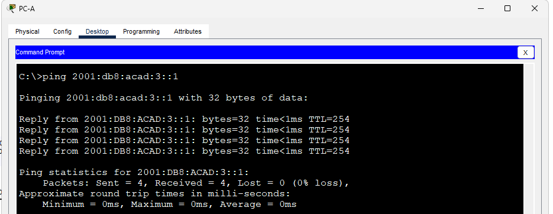

## Лабраторная работа - Настройка DHCPv6 
### Топология

## Задачи
### Часть 1. Создание сети и настройка основных параметров устройства
### Часть 2. Проверка назначения адреса SLAAC от R1
### Часть 3. Настройка и проверка сервера DHCPv6 без гражданства на R1
### Часть 4. Настройка и проверка состояния DHCPv6 сервера на R1
### Часть 5. Настройка и проверка DHCPv6 Relay на R2
## Часть 1. Создание сети и настройка основных параметров устройства
### Шаг 1. Создайте сеть согласно топологии.
### Шаг 2. Настройте базовые параметры каждого коммутатора. (необязательно)
### Шаг 3. Произведите базовую настройку маршрутизаторов.
#### [Базовая настройка маршрутизатора R1, выполнение комманд.](InnR1)
#### [Базовая настройка маршрутизатора R2, выполнение комманд.](InnR2)
### Шаг 4. Настройка интерфейсов и маршрутизации для обоих маршрутизаторов.
#### [Настройка интерфейсов и маршрута по умолчанию на маршрутизаторе R1, выполнение комманд.](CommR11)
#### [Настройка интерфейсов и маршрута по умолчанию на маршрутизаторе R2, выполнение комманд.](CommR21)
#### Проверка настроек - команда ping адреса инт. G0/0/1 R2 c R1:
###### R1#ping 2001:db8:acad:3::1
###### Type escape sequence to abort.
###### Sending 5, 100-byte ICMP Echos to 2001:db8:acad:3::1, timeout is 2 seconds:
###### !!!!!
###### Success rate is 100 percent (5/5), round-trip min/avg/max = 0/0/0 ms
## Часть 2. Проверка назначения адреса SLAAC от R1
#### Включение маршрутизации IPv6 на обоих маршрутизаторов командой ipv6 unicast-routing
##### Результат выполнения команды ipconfig /all на ПК PC-A:

### Откуда взялась часть адреса с идентификатором хоста?
#### Ответ: была сгенерирована автоматически на основе MAC адреса интерфейса.
## Часть 3. Настройка и проверка сервера DHCPv6 на R1
### Шаг 1. Более подробно изучите конфигурацию PC-A.

##### DNS-суффикс и адрес DNS сераера отсутствуют, т.к. отстуствуют соответствующие настройки на R1, выступающего в роли источника.
### Шаг 2. Настройте R1 для предоставления DHCPv6 без состояния для PC-A.
#### Настройка DNS-суффикса и адреса DNS сервера в пуле R1-STATELESS на маршрктизаторе R1, выступающего в роли DHCP сервера. Выполнение команд:
###### R1(config)#ipv6 dhcp pool R1-STATELESS
###### R1(config-dhcpv6)#dns-server 2001:db8:acad::254
###### R1(config-dhcpv6)#domain-name STATELESS.com
###### R1(config-dhcpv6)#end
###### R1#
###### %SYS-5-CONFIG_I: Configured from console by console
###### R1#conf t
###### Enter configuration commands, one per line.  End with CNTL/Z.
###### R1(config)#int g0/0/1
###### R1(config-if)#ipv6 nd other-config-flag
###### R1(config-if)#ipv6 dhcp server R1-STATELESS
#### Проверка получения настроенных параметров на PC-A, результат выполнения команды ipconfig /all:

##### Проверка доступности инт. G0/0/1 на R2 с ПК PC-A, выполнение команды ping:

## Часть 4. Настройка сервера DHCPv6 с сохранением состояния на R2 (т.к. в CPT не работает ретрансляция DHCP запросов для IPv6)
#### Настройка DHCP пула для варианта DHCP сервера с сохранением состояния, выполнение команд на R2:
###### R2(config)# ipv6 dhcp pool R2-STATEFUL
###### R2(config-dhcp)# address prefix 2001:db8:acad:3:aaa::/80
###### R2(config-dhcp)# dns-server 2001:db8:acad::254
###### R2(config-dhcp)# domain-name STATEFUL.com
#### Назначение только что созданного пула DHCPv6 интерфейсу g0/0/1 на R2.
###### R2(config)# interface g0/0/1
###### R2(config-if)# ipv6 dhcp server R2-STATEFUL
