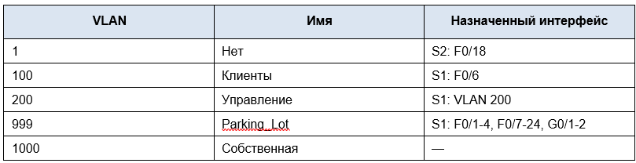
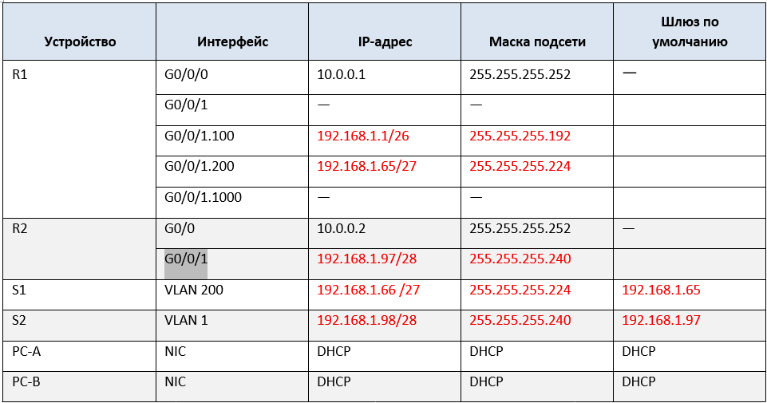
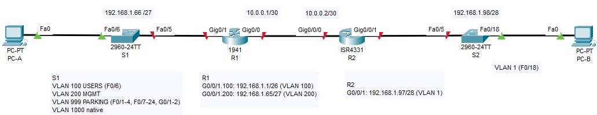

## Лабораторная работа - Реализация DHCPv4 
#### Таблица VLAN

### Задачи
#### Часть 1. Создание сети и настройка основных параметров устройства
#### Часть 2. Настройка и проверка двух серверов DHCPv4 на R1
#### Часть 3. Настройка и проверка DHCP-ретрансляции на R2
## Часть 1.	Создание сети и настройка основных параметров устройства
### Шаг 1.	Создание схемы адресации
#### Таблица адресации

### Шаг 2.	Создайте сеть согласно топологии.
#### Топология

#### Шаг 3.	Произведите базовую настройку маршрутизаторов.
#### Шаг 4.	Настройка маршрутизации между сетями VLAN на маршрутизаторе R1
#### Результаты после всех выполненных настроек:
##### [Результат выполнения команды sh ip int br](R1ShIpIntbr1)
##### [Результат выполнения команды sh ip route](R1ShIpRoute)
##### [Конфигурация R1 после шагов 3 и 4](ConfR11)
##### [Конфигурация R2 после шагов 3 и 4](ConfR21)
### Шаг 5.	Настройте G0/1 на R2, затем G0/0/0 и статическую маршрутизацию для обоих маршрутизаторов
##### R2, настройка IP-адреса  192.168.1.97/28 на порту G0/0/1: ip add 192.168.1.97 255.255.255.240
##### R2, настройка IP-адреса  10.0.0.2/30 на порту G0/0/0: ip add 10.0.0.2 255.255.255.252
##### R2, настройка маршрута по умолчанию: R2(config)#ip route 0.0.0.0 0.0.0.0 10.0.0.1
##### R1, настройка IP-адреса  10.0.0.1/30 на порту G0/0/0: ip add 10.0.0.1 255.255.255.252
##### R1, настройка маршрута по умолчанию: R1(config)#ip route 0.0.0.0 0.0.0.0 10.0.0.2
#### R1, проверка доступности IP-адреса на порту G0/0/1 маршрутизатора R2:
######      R1#ping 192.168.1.97
######      Type escape sequence to abort.
######      Sending 5, 100-byte ICMP Echos to 192.168.1.97, timeout is 2 seconds:
######      !!!!!
######      Success rate is 100 percent (5/5), round-trip min/avg/max = 0/0/3 ms
#### R2, проверка доступности IP-адреса на порту G0/0/1.200 маршрутизатора R1:
###### R2#ping 192.168.1.65
###### Type escape sequence to abort.
###### Sending 5, 100-byte ICMP Echos to 192.168.1.65, timeout is 2 seconds:
###### !!!!!
###### Success rate is 100 percent (5/5), round-trip min/avg/max = 0/0/0 ms
### IP-связанность настроена.
### Шаг 6.	Настройте базовые параметры каждого коммутатора.
##### [Команды базовой настройки на коммутаторе S1](CommS11)
##### [Команды базовой настройки на коммутаторе S2](CommS21)
### Шаг 7.	Создайте сети VLAN на коммутаторе S1.
#### Коммутатор S1: cоздание VLAN, настройка интерфейса управления, неиспользуемые порты в VLAN 999 и деактивация:
##### [Команды на коммутаторе S1](CommS12)
#### Коммутатор S2: настройка интерфейса управления в VLAN 1, деактивация неиспользуемых портов:
##### [Команды на коммутаторе S1](CommS22)
