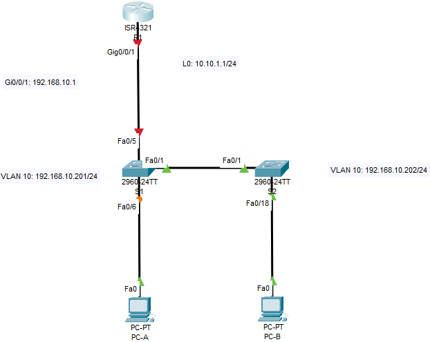
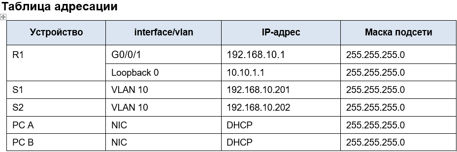

## Лабораторная работа - Конфигурация безопасности коммутатора 

### Цели
### Часть 1. Настройка основного сетевого устройства
#### •	Создайте сеть.
#### •	Настройте маршрутизатор R1.
#### •	Настройка и проверка основных параметров коммутатора
### Часть 2. Настройка сетей VLAN
#### •	Сконфигруриуйте VLAN 10.
#### •	Сконфигруриуйте SVI для VLAN 10.
#### •	Настройте VLAN 333 с именем Native на S1 и S2.
#### •	Настройте VLAN 999 с именем ParkingLot на S1 и S2.
### Часть 3: Настройки безопасности коммутатора.
#### •	Реализация магистральных соединений 802.1Q.
#### •	Настройка портов доступа
#### •	Безопасность неиспользуемых портов коммутатора
#### •	Документирование и реализация функций безопасности порта.
#### •	Реализовать безопасность DHCP snooping .
#### •	Реализация PortFast и BPDU Guard
#### •	Проверка сквозной связанности.
## Часть 1. Настройка основного сетевого устройства
### Шаг 1. Создайте сеть.
#### a.	Создайте сеть согласно топологии.
#### b.	Инициализация устройств
#### Сеть создана, согласно топологии, необходимые линии связи подключены (см. схему, приведенную выше)
### Шаг 2. Настройте маршрутизатор R1.
#### a.	Загрузите следующий конфигурационный скрипт на R1.
#### [Конфигурационный скрипт для R1](ConfigR1)
#### Отдельно добавляем настройку командой: R1(config)#ip dhcp relay information trust-all,
#### т.к. в CPT не работет настройка ip dhcp relay information trusted для конкретного интерфейса.
#### [Проверка текущей конфигурации на R1  командой: R1# show ip interface brief](ShIpIntBr)
### Шаг 3. Настройка и проверка основных параметров коммутатора
#### a.	Настройте имя хоста для коммутаторов S1 и S2.
#### b.	Запретите нежелательный поиск в DNS.
#### c.	Настройте описания интерфейса для портов, которые используются в S1 и S2.
#### d.	Установите для шлюза по умолчанию для VLAN управления значение 192.168.10.1 на обоих коммутаторах.
## Часть 2. Настройка сетей VLAN на коммутаторах.
### Шаг 1. Сконфигруриуйте VLAN 10.
#### Добавьте VLAN 10 на S1 и S2 и назовите VLAN - Management.
### Шаг 2. Сконфигруриуйте SVI для VLAN 10.
#### Настройте IP-адрес в соответствии с таблицей адресации для SVI для VLAN 10 на S1 и S2. Включите интерфейсы SVI и предоставьте описание для интерфейса.
### Шаг 3. Настройте VLAN 333 с именем Native на S1 и S2.
### Шаг 4. Настройте VLAN 999 с именем ParkingLot на S1 и S2.
#### [Конфигурация коммутатора S1 после выполнения настроек, приведенных выше](ConfS11)
#### [Результат выполнения команды sh vlan на S1](VlanS11)
#### [Конфигурация коммутатора S2 после выполнения настроек, приведенных выше](ConfS21)
#### [Результат выполнения команды sh vlan на S2](VlanS21)
## Часть 3. Настройки безопасности коммутатора.
### Шаг 1. Релизация магистральных соединений 802.1Q.
#### Настройка магистральных портов Fa0/1 в режим trunk для vlan 10, 333. Установка vlan 333 в качестве native vlan. Выполнение команд на примере S2:
###### S2(config)#int fa0/1
###### S2(config-if)#sw mo tr
###### S2(config-if)#sw tr allowed vlan 10,333
###### S2(config-if)#sw tr native vlan 333
##### [Результат выполнения команды S1#show interface trunk](ShIntTrS1)
##### [Результат выполнения команды S2#show interface trunk](ShIntTrS2)
#### Отключение согласовния DTP на порту F0/1 для коммутаторов S1 и S2. Выполнение команды sw nonegotiate в режиме конфигурации порта F0/1.
#### [Результат выполнения команды sh int f0/1 sw для S1](ShIntSwS1)
#### [Результат выполнения команды sh int f0/1 sw для S2](SwIntSwS2)
### Шаг 2. Настройка портов доступа
#### a.	На S1 настройте F0/5 и F0/6 в качестве портов доступа и свяжите их с VLAN 10.
#### b.	На S2 настройте порт доступа Fa0/18 и свяжите его с VLAN 10.
### Шаг 3. Безопасность неиспользуемых портов коммутатора
#### a.	На S1 и S2 переместите неиспользуемые порты из VLAN 1 в VLAN 999 и отключите неиспользуемые порты.
#### b.	Убедитесь, что неиспользуемые порты отключены и связаны с VLAN 999, введя команду  show.
### Результат выполнения шагов 2 и 3, проверка настроек командой show int status для обоих коммутаторов:
#### [Результат выполнения команды S1# show interfaces status:](ShIntStatS1)
#### [Результат выполнения команды S2# show interfaces status:](ShIntStatS2)
