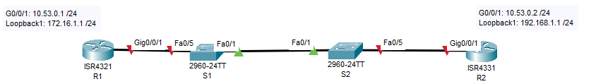
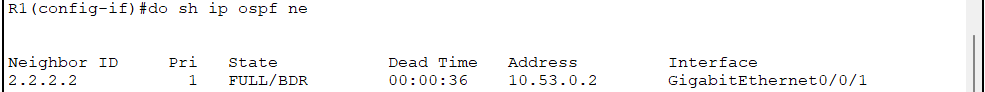
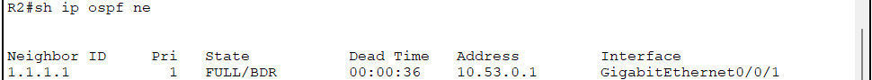
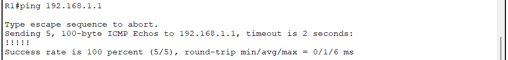
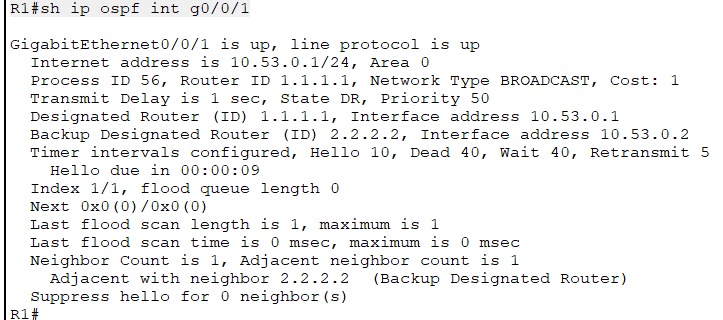

## Лабораторная работа. Настройка протокола OSPFv2 для одной области
### Топология

## Цели
### Часть 1. Создание сети и настройка основных параметров устройства
### Часть 2. Настройка и проверка базовой работы протокола  OSPFv2 для одной области
### Часть 3. Оптимизация и проверка конфигурации OSPFv2 для одной области
## Часть 1. Создание сети и настройка основных параметров устройства
### Шаг 1. Создайте сеть согласно топологии.
### Шаг 2. Произведите базовую настройку маршрутизаторов.
### Шаг 3. Настройте базовые параметры каждого коммутатора.
#### [Конфигурация маршрутизатора R1 после первоначальной настройки](InnR1)
#### [Конфигурация маршрутизатора R2 после первоначальной настройки](InnR2)
#### [Конфигурация коммутатора S1 после первоначальной настройки](InnS1)
#### [Конфигурация коммутатора S2 после первоначальной настройки](InnS2)
## Часть 2. Настройка и проверка базовой работы протокола OSPFv2 для одной области
### Шаг 1. Настройте адреса интерфейса и базового OSPFv2 на каждом маршрутизаторе.
#### a. Настройка адресов интерфейсов, согласно таблице IP-адресации
##### Выполнение команд для R1:
###### R1(config)#int g0/0/1
###### R1(config-if)#ip add 10.53.0.1 255.255.255.0
###### R1(config-if)#no sh
###### R1(config)#int loopback1 
###### R1(config-if)#ip add 172.16.1.1 255.255.255.0
##### Выполнение команд для R2:
###### R2(config)#int g0/0/1
###### R2(config-if)#ip add 10.53.0.2 255.255.255.0
###### R2(config-if)#no sh
###### R2(config-if)#int loopback1
###### R2(config-if)#ip add 192.168.1.1 255.255.255.0
#### b. Переход в режим настройки OSPF с идентификатором процесса 56: выполнение команды router ospf 56.
#### c. Настройка статических идентификаторов маршрутизаторов 1.1.1.1 для R1 и 2.2.2.2 для R2, выполнение команд:
###### R1(config-router)#router-id 1.1.1.1
###### R1#clear ip ospf process 
###### R2(config-router)#router-id 2.2.2.2
###### R2#clear ip ospf process 
#### d.	Настройте инструкцию сети для сети между R1 и R2, поместив ее в область 0.
##### Для R1:
###### R1(config)#int g0/0/1
###### R1(config-if)#ip ospf 56 area 0
##### Для R2:
###### R2(config)#int g0/0/1
###### R2(config-if)#ip ospf 56 area 0
##### e.	Только на R2 добавьте конфигурацию, необходимую для объявления сети Loopback 1 в область OSPF 0: 
###### R2(config-if)#int loopback1
###### R2(config-if)#ip ospf 56 area 0
##### f.	Убедитесь, что OSPFv2 работает между маршрутизаторами. Выполните команду, чтобы убедиться, что R1 и R2 сформировали смежность: R1(config-if)#do sh ip ospf ne

##### R2(config-if)#do sh ip ospf ne:

##### Маршрутизатор R1 является BDR, маршрутизатор R2 является DR. Выбор производился по Router-ID - у R2 он выше. 
#### g. Проверка присутствия сети R2 Loopback1 в таблице маршрутизации R1:
###### R1#sh ip route ospf
######     192.168.1.0/32 is subnetted, 1 subnets
###### O       192.168.1.1 [110/2] via 10.53.0.2, 00:05:07, GigabitEthernet0/0/1
###### h. Выполнение команды ping  интерфейса R2 Loopback1  с маршрутизатора R1:

## Часть 3. Оптимизация и проверка конфигурации OSPFv2 для одной области
### Шаг 1. Реализация различных оптимизаций на каждом маршрутизаторе.
##### a.	На R1 настройте приоритет OSPF интерфейса G0/0/1 на 50, чтобы убедиться, что R1 является назначенным маршрутизатором.
##### Выполнение команд на R1:
###### R1(config-if)#ip ospf priority 50
###### R1#clear ip ospf pro
###### R1#sh ip ospf int g0/0/1
##### В результате изменения приоритета интерфейса на R1 он становится DR:

##### b.	Настройте таймеры OSPF на G0/0/1 каждого маршрутизатора для таймера приветствия, составляющего 30 секунд.
###### Выполнение команды ip ospf hello-interval 30 на обоих маршрутизаторах в режиме конфигурации интерфейса G0/0/1.
##### c.	На R1 настройте статический маршрут по умолчанию, который использует интерфейс Loopback 1 в качестве интерфейса выхода. Затем распространите маршрут по умолчанию в OSPF. Обратите внимание на сообщение консоли после установки маршрута по умолчанию.
##### Выполнение команд на R1:
###### R1(config)#ip route 0.0.0.0 0.0.0.0 loopback 1
###### R1(config-router)#default-information originate 
###### Проверка, что маршрут 0.0.0.0 0.0.0.0 пуступил на R2:
#### [Выполнение команды sh ip route на R2](shiprouteR22)
##### d.	добавьте конфигурацию, необходимую для OSPF для обработки R2 Loopback 1 как сети точка-точка. Это приводит к тому, что OSPF объявляет Loopback 1 использует маску подсети интерфейса.
##### Выполнение команд на R2:
###### R2(config)#int loopback 1
###### R2(config-if)#ip ospf network point-to-point 
##### e.	Только на R2 добавьте конфигурацию, необходимую для предотвращения отправки объявлений OSPF в сеть Loopback 1.
##### Выполнение команд на R2:
###### R2(config)#router ospf 56
###### R2(config-router)#passive-interface loopback 1
##### f.	Измените базовую пропускную способность для маршрутизаторов. После этой настройки перезапустите OSPF с помощью команды clear ip ospf process . Обратите внимание на сообщение консоли после установки новой опорной полосы пропускания.
##### Выыполнение команд на маршрутизаторах:
###### R1(config)#router ospf 56
###### R1(config-router)#auto-cost reference-bandwidth 10000
##### Появляется сообщение о необходимости настройки этого параметра на всех маршрутизаторах в едином домене OSPF:
###### % OSPF: Reference bandwidth is changed. Please ensure reference bandwidth is consistent across all routers.
##### После выполнения команды перезапуска OSPF  соседские значения устанавливаются снова.
### Шаг 2. Убедитесь, что оптимизация OSPFv2 реализовалась.
#### a. Выполнение команды show ip ospf interface g0/0/1 на R1:
