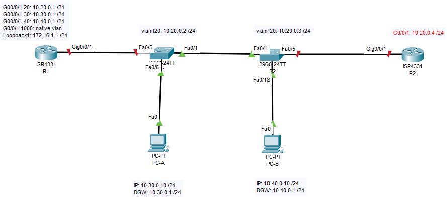
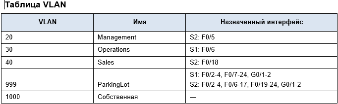
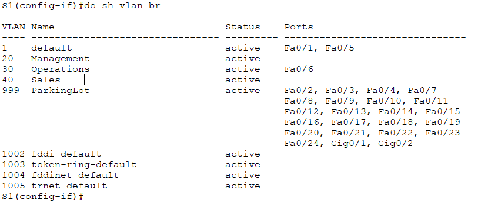
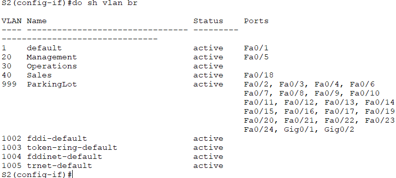
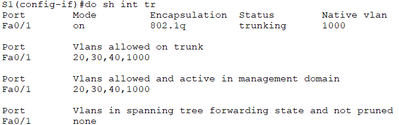
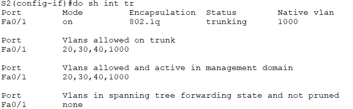
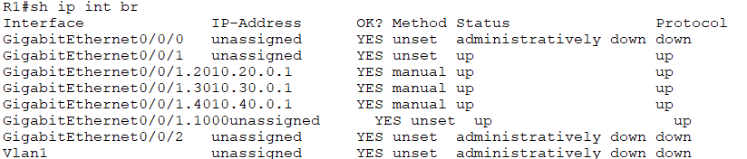

## Лабораторная работа. Настройка и проверка расширенных списков контроля доступа.
### Топология

## Задачи
### Часть 1. Создание сети и настройка основных параметров устройства
### Часть 2. Настройка и проверка списков расширенного контроля доступа
## Часть 1. Создание сети и настройка основных параметров устройства
### Шаг 1. Создайте сеть согласно топологии.
### Шаг 2. Произведите базовую настройку маршрутизаторов.
### Шаг 3. Настройте базовые параметры каждого коммутатора.
## Часть 2. Настройка сетей VLAN на коммутаторах.
### Шаг 1. Создайте сети VLAN на коммутаторах.
### Шаг 2. Назначьте сети VLAN соответствующим интерфейсам коммутатора.
#### Выполнение команды на S1: show vlan brief

#### Выполнение команды на S2: show vlan brief

## Часть 3. ·Настройте транки (магистральные каналы).
### Шаг 1. Вручную настройте магистральный интерфейс F0/1.
#### Выполнение команды на S1: show int trunk

#### Выполнение команды на S2: show int trunk

### Шаг 2. Вручную настройте магистральный интерфейс F0/5 на коммутаторе S1.
#### Выполнение команды на S1: show int trunk

## Часть 4. Настройте маршрутизацию.
### Шаг 1. Настройка маршрутизации между сетями VLAN на R1.
#### Выполнение команды на R1: show ip int br
 
### Шаг 2. Настройка интерфейса R2 g0/0/1 с использованием адреса из таблицы и маршрута по умолчанию с адресом следующего перехода 10.20.0.1
## Часть 5. Настройте удаленный доступ
### Шаг 1. Настройте все сетевые устройства для базовой поддержки SSH.
