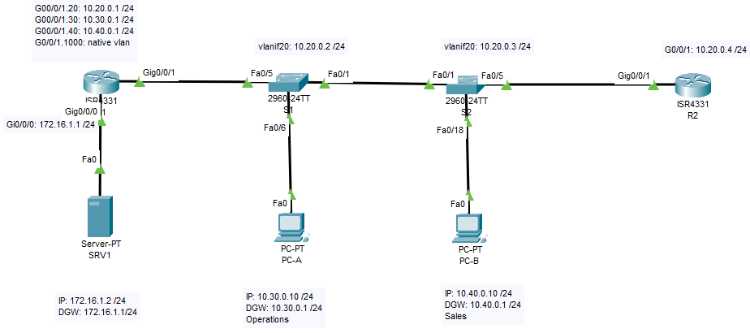
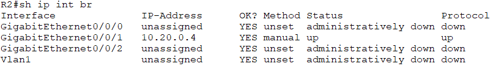
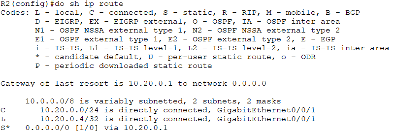
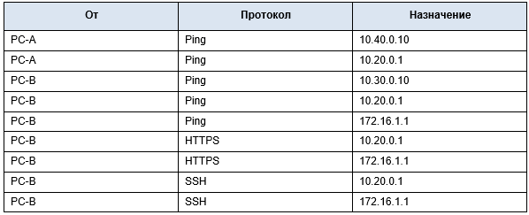

## Лабораторная работа. Настройка и проверка расширенных списков контроля доступа.
### Топология

## Задачи
### Часть 1. Создание сети и настройка основных параметров устройства
### Часть 2. Настройка и проверка списков расширенного контроля доступа
## Часть 1. Создание сети и настройка основных параметров устройства
### Шаг 1. Создайте сеть согласно топологии.
### Шаг 2. Произведите базовую настройку маршрутизаторов.
### Шаг 3. Настройте базовые параметры каждого коммутатора.
## Часть 2. Настройка сетей VLAN на коммутаторах.
### Шаг 1. Создайте сети VLAN на коммутаторах.
### Шаг 2. Назначьте сети VLAN соответствующим интерфейсам коммутатора.
#### Выполнение команды на S1: show vlan brief

#### Выполнение команды на S2: show vlan brief

## Часть 3. ·Настройте транки (магистральные каналы).
### Шаг 1. Вручную настройте магистральный интерфейс F0/1.
#### Выполнение команды на S1: show int trunk

#### Выполнение команды на S2: show int trunk

### Шаг 2. Вручную настройте магистральный интерфейс F0/5 на коммутаторе S1.
#### Выполнение команды на S1: show int trunk

## Часть 4. Настройте маршрутизацию.
### Шаг 1. Настройка маршрутизации между сетями VLAN на R1.
#### Выполнение команды на R1: show ip int br
 
### Шаг 2. Настройка интерфейса R2 g0/0/1 с использованием адреса из таблицы и маршрута по умолчанию с адресом следующего перехода 10.20.0.1
#### Выполнение команды на R2: show ip int br
 
#### Выполнение команды на R2: show ip route
 
## Часть 5. Настройте удаленный доступ
### Шаг 1. Настройте все сетевые устройства для базовой поддержки SSH.
###### a.	Создайте локального пользователя с именем пользователя SSHadmin и зашифрованным паролем $cisco123!
###### b.	Используйте ccna-lab.com в качестве доменного имени.
###### c.	Генерируйте криптоключи с помощью 1024 битного модуля.
###### d.	Настройте первые пять линий VTY на каждом устройстве, чтобы поддерживать только SSH-соединения и с локальной аутентификацией.
#### [Выполнение команды на примере S2:](SSH)
### Шаг 2. Настройка маршрутизатора R1 для подключения сервера SRV1:
#### Настройка IP-адреса интерфейса Gi0/0/0: 172.16.1.1 /24
#### Настройка IP-адреса интерфейса Fa0 сервера SRV1: 172.16.1.2 /24
## Часть 6. Проверка подключения
### Шаг 1. Настройте узлы ПК.
#### Адреса ПК можно посмотреть в таблице адресации.
##### Выполнена настройка адресации согласно таблице и схемы топологии.
#### [Конфигурация R1 после всех настроек](confR1)
#### [Конфигурация R2 после всех настроек](confR2)
#### [Конфигурация S1 после всех настроек](confS1)
#### [Конфигурация S2 после всех настроек](confS2)
### Шаг 2. Выполните следующие тесты. Эхозапрос должен пройти успешно.
### Таблица проверок:
 
#### Т.к. HTTP/HTTPS развернуты на выделенном сервере SRV1 (IP: 172.16.1.2), то проверки HTTPS из таблицы необходимо выполнить на адрес 172.16.1.2.
#### Все проверки проходят успешно!
## Часть 7. Настройка и проверка списков контроля доступа (ACL)
##### При проверке базового подключения компания требует реализации следующих политик безопасности:
#### Политика1. Сеть Sales не может использовать SSH в сети Management (но в  другие сети SSH разрешен). 
#### Политика 2. Сеть Sales не имеет доступа к IP-адресам в сети Management с помощью любого веб-протокола (HTTP/HTTPS). Сеть Sales также не имеет доступа к интерфейсам R1 с помощью любого веб-протокола. Разрешён весь другой веб-трафик (обратите внимание — Сеть Sales  может получить доступ к интерфейсу Loopback 1 на R1).
#### Политика3. Сеть Sales не может отправлять эхо-запросы ICMP в сети Operations или Management. Разрешены эхо-запросы ICMP к другим адресатам. 
#### Политика 4: Cеть Operations  не может отправлять ICMP эхозапросы в сеть Sales. Разрешены эхо-запросы ICMP к другим адресатам. 
##### Для проверки политики №2 - запрет доступа подсети Sales к IP-адресам в сети Management  с помощью любого веб-проотокола (HTTP/HTTPS) и т.к. в CPT нет возможности реализовать веб-сервер на роутере R1, в топологию включен дополнительный сервер WEB INT (IP:10.20.0.10/24) порт Fa0/2 на коммутаторе в режиме access VLAN 20.
 
