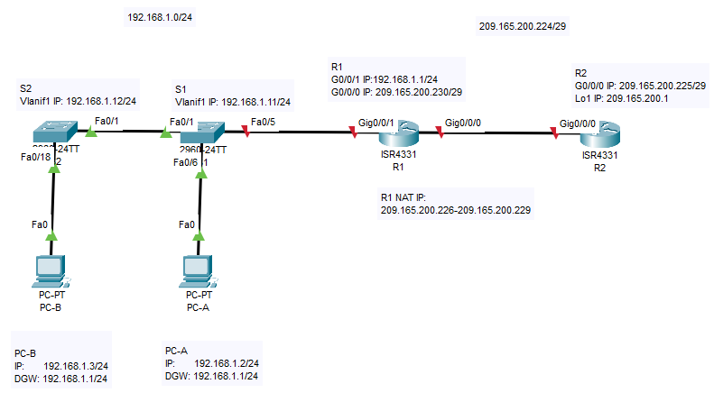
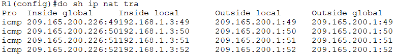
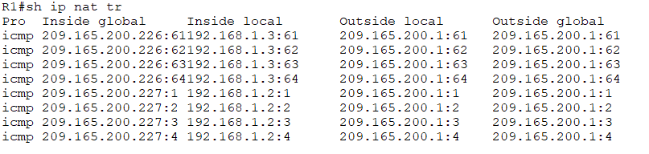
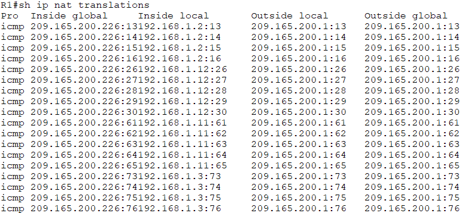
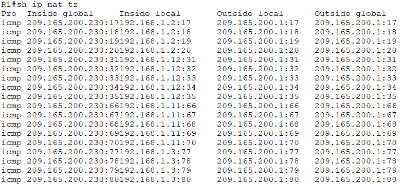

# Лабораторная работа - Настройка NAT для IPv4
### Топология

## Цели
## Часть 1. Создание сети и настройка основных параметров устройства
## Часть 2. Настройка и проверка NAT для IPv4
## Часть 3. Настройка и проверка PAT для IPv4
## Часть 4. Настройка и проверка статического NAT для IPv4.
#### Общие сведения/сценарий
##### Преобразование (NAT) — это процесс, при котором сетевое устройство, например маршрутизатор Cisco, назначает публичный адрес узлам в пределах частной сети. NAT используют для сокращения количества публичных IP-адресов, используемых организацией, поскольку количество доступных публичных IPv4-адресов ограничено.
##### Интернет-провайдер выделил компании общедоступное пространство IP-адресов 209.165.200.224/29. Эта сеть используется для обращения к каналу между маршрутизатором ISP (R2) и шлюзом компании (R1). Первый адрес (209.165.200.225) назначается интерфейсу g0/0 на R2, а последний адрес (209.165.200.230) назначается интерфейсу g0/0/0 на R1. Остальные адреса (209.165.200.226-209.165.200.229) будут использоваться для предоставления доступа в Интернет хостам компании. Маршрут по умолчанию используется от R1 до R2. Подключение интернет-провайдера к Интернету смоделировано loopback-адресом на маршрутизаторе интернет-провайдера.
##### В этой лабораторной работе  вы будете настраивать различные типы NAT. Вы выполните тестирование, отображение и проверку осуществления всех преобразований и проанализируете статистику NAT/PAT для контроля процесса.
### Инструкции
## Часть 1. Создание сети и настройка основных параметров устройства
##### В первой части лабораторной работы вам предстоит создать топологию сети и настроить базовые параметры для узлов ПК и коммутаторов.
### Шаг 1. Подключите кабели сети согласно приведенной топологии.
##### Подключите устройства в соответствии с топологией и подсоедините соответствующие кабели.
### Шаг 2. Произведите базовую настройку маршрутизаторов.
##### Откройте окно конфигурации
##### a.	Назначьте маршрутизатору имя устройства.
##### b.	Отключите поиск DNS, чтобы предотвратить попытки маршрутизатора неверно преобразовывать введенные команды таким образом, как будто они являются именами узлов.
##### c.	Назначьте class в качестве зашифрованного пароля привилегированного режима EXEC.
##### d.	Назначьте cisco в качестве пароля консоли и включите вход в систему по паролю.
##### e.	Назначьте cisco в качестве пароля VTY и включите вход в систему по паролю.
##### f.	Зашифруйте открытые пароли.
##### g.	Создайте баннер с предупреждением о запрете несанкционированного доступа к устройству.
##### h.	Настройте IP-адресации интерфейса, как указано в таблице выше.
##### i.	Настройте маршрут по умолчанию. от R2 до  R1.
##### j.	Сохраните текущую конфигурацию в файл загрузочной конфигурации.
##### Закройте окно настройки.
### Шаг 3. Настройте базовые параметры каждого коммутатора.
##### Откройте окно конфигурации
##### a.	Присвойте коммутатору имя устройства.
##### b.	Отключите поиск DNS, чтобы предотвратить попытки маршрутизатора неверно преобразовывать введенные команды таким образом, как будто они являются именами узлов.
##### c.	Назначьте class в качестве зашифрованного пароля привилегированного режима EXEC.
##### d.	Назначьте cisco в качестве пароля консоли и включите вход в систему по паролю.
##### e.	Назначьте cisco в качестве пароля VTY и включите вход в систему по паролю.
##### f.	Зашифруйте открытые пароли.
##### g.	Создайте баннер с предупреждением о запрете несанкционированного доступа к устройству.
##### h.	Выключите все интерфейсы, которые не будут использоваться.
##### i.	Настройте IP-адресации интерфейса, как указано в таблице выше.
##### j.	Сохраните текущую конфигурацию в файл загрузочной конфигурации.
### Итоговые конфигурации сетевого оборудования после выполнения шагов 1-3:
##### Дополнительно на R1 необходимо прописать мршрут до сети 209.165.200.0 /27 (в которой находится Loopback 1 маршрутизатора R2):
###### R1(config)#ip route 209.165.200.0 255.255.255.224 209.165.200.225
##### Дополнительно на S1 и S2 необходимо настроить адрес шлза по умолчанию (192.168.1.1) выполнением команды:
###### ip default-gateway 192.168.1.1
#### [Конфигурация R1 после всех настроек](ConfR1)
#### [Конфигурация R2 после всех настроек](ConfR2)
#### [Конфигурация S1 после всех настроек](ConfS1)
#### [Конфигурация S2 после всех настроек](ConfS2)
## Часть 2. Настройка и проверка NAT для IPv4.
##### В части 2 необходимо настроить и проверить NAT для IPv4.
### Шаг 1. Настройте NAT на R1, используя пул из трех адресов 209.165.200.226-209.165.200.228. 
##### Откройте окно конфигурации
##### a.	Настройте простой список доступа, который определяет, какие хосты будут разрешены для трансляции. В этом случае все устройства в локальной сети R1 имеют право на трансляцию.
###### R1(config)# access-list 1 permit 192.168.1.0 0.0.0.255 
##### b.	Создайте пул NAT и укажите ему имя и диапазон используемых адресов.
###### R1(config)# ip nat pool PUBLIC_ACCESS 209.165.200.226 209.165.200.228 netmask 255.255.255.248 
##### Примечание. Параметр маски сети не является разделителем IP-адресов. Это должна быть правильная маска подсети для назначенных адресов, даже если вы используете не все адреса подсети в пуле. 
##### c.	Настройте перевод, связывая ACL и пул с процессом преобразования.
###### R1(config)# ip nat inside source list 1 pool PUBLIC_ACCESS 
##### Примечание: Три очень важных момента. Во-первых, слово «inside» имеет решающее значение для работы такого рода NAT. Если вы опустить его, NAT не будет работать. Во-вторых, номер списка — это номер ACL, настроенный на предыдущем шаге. В-третьих, имя пула чувствительно к регистру. 
##### d.	Задайте внутренний (inside) интерфейс. 
###### R1(config)# interface g0/0/1
###### R1(config-if)# ip nat inside
##### e.	Определите внешний (outside) интерфейс.
###### R1(config)# interface g0/0/0
###### R1(config-if)# ip nat outside
### Шаг 2. Проверьте и проверьте конфигурацию. 
##### a.	С PC-B,  запустите эхо-запрос интерфейса Lo1 (209.165.200.1) на R2. Если эхо-запрос не прошел, выполните процес поиска и устранения неполадок. На R1 отобразите таблицу NAT на R1 с помощью команды show ip nat translations.
##### Результат выполнения команды sh ip nat tr на R1 после успешного выполнения команды ping 209.165.200.1 на PC-B:

##### Во что был транслирован внутренний локальный адрес PC-B?
###### Внутренний локальный (Inside local) адрес PC-B 192.168.1.3 был транслирован в внутренний глобальный (Inside global) адрес 209.165.200.226
#### Какой тип адреса NAT является переведенным адресом?
###### Транслируемым адресом является внутренний локальный (Inside local)- адрес PC-B 192.168.1.3
##### b.	С PC-A, запустите  эхо-запрос интерфейса Lo1 (209.165.200.1) на R2. Если эхо-запрос не прошел, выполните отладку. На R1 отобразите таблицу NAT на R1 с помощью команды show ip nat translations.
##### Результат выполнения команды sh ip nat tr на R1 после успешного выполнения команды ping 209.165.200.1 на PC-B и на PC-A:

##### c.	Обратите внимание, что предыдущая трансляция для PC-B все еще находится в таблице. Из S1, эхо-запрос интерфейса Lo1 (209.165.200.1) на R2. Если эхо-запрос не прошел, выполните отладку. На R1 отобразите таблицу NAT на R1 с помощью команды show ip nat translations.
###### Эхо запрос проходит успешно!
##### d.	Теперь запускаем пинг R2 Lo1 из S2. На этот раз выполнение команды завершается неудачей, т.к. в созданном пуле PUBLIC_ACCESS всего 3 адреса для NAT трансляций, см. следующий пнкт "е".
##### e.	Результат выполнения команды show ip nat translations на R1:

## Часть 3. Настройка и проверка PAT для IPv4.
### Шаги 1-3
##### На R1 удаляем настройку, свзывающую ACL 1 и созданный пул PUBLIC_ACCESS выполнением команды:
###### R1(config)# no ip nat inside source list 1 pool PUBLIC_ACCESS
##### Добавление PAT на R1 выполнением команды:
###### R1(config)# ip nat inside source list 1 pool PUBLIC_ACCESS overload
##### Осуществляем проверку выполнением команды ping 209.165.200.1 одновременно на PC-A, PC-B, S1, S2.
##### Все эхо-запросы и ответы проходят успешно.
##### Результат выполнения команды sh ip nat tr на R1:

##### Теперь для NAT-трансляций используется один адрес из всего пула, изменяется номер последовательности ICMP для всех транслируемых адресов из подсети 192.168.1.0/24
##### В нашем сценарии не эффективно использовать пул из 3-х адресов, будет достаточно одного или настроить NAT-трансляции с привязкой к интерфейсу G0/0/0 маршрутизатора R1.
### Шаг 4. На R1 удалите команды преобразования nat pool.
##### Опять же, наш список доступа (список доступа 1) по-прежнему корректен для сетевого сценария, поэтому нет необходимости воссоздавать его. Кроме того, внутренний и внешний интерфейсы не меняются. Чтобы начать работу с PAT к интерфейсу, очистите конфигурацию, удалив пул NAT и команду, связывающую ACL и пул вместе.
###### R1(config)# no ip nat inside source list 1 pool PUBLIC_ACCESS overload 
###### R1(config)# no ip nat pool PUBLIC_ACCESS
### Шаг 5. Добавьте команду PAT overload, указав внешний интерфейс.
##### Добавьте команду PAT, которая вызовет перегрузку внешнего интерфейса.
###### R1(config)# ip nat inside source list 1 interface g0/0/0 overload 
### Шаг 6. Протестируйте и проверьте конфигурацию. 
##### Осуществляем проверку выполнением команды ping 209.165.200.1 одновременно на PC-A, PC-B, S1, S2.
##### Все эхо-запросы и ответы проходят успешно.
##### Результат выполнения команды sh ip nat tr на R1:

##### Теперь для NAT-трансляций используется IP-адрес Интерфейса g0/0/0 маршрутизатора R1 (209.165.200.230), изменяется номер последовательности ICMP для всех транслируемых адресов из подсети 192.168.1.0/24
## Часть 4. Настройка и проверка статического NAT для IPv4.
##### В части 4 будет настроена статическая NAT таким образом, чтобы PC-A был доступен напрямую из Интернета. PC-A будет доступен из R2 по адресу 209.165.200.229.
### Шаг 1. На R1 очистите текущие трансляции и статистику.
##### Откройте окно конфигурации
###### R1# clear ip nat translations * 
###### R1# clear ip nat statistics 
### Шаг 2. На R1 настройте команду NAT, необходимую для статического сопоставления внутреннего адреса с внешним адресом.
##### Для этого шага настройте статическое сопоставление между 192.168.1.11 и 209.165.200.1 с помощью следующей команды:
###### R1(config)# ip nat inside source static 192.168.1.2 209.165.200.229 
### Шаг 3. Протестируйте и проверьте конфигурацию.
##### a.	Проверка, что статический NAT работает. На R1 отобразите таблицу NAT на R1 с помощью команды show ip nat translations, и вы увидите статическое сопоставление.
R1# show ip nat translations
Pro Inside global Inside local Outside local Outside global
--- 209.165.200.229 192.168.1.2 --- ---
Total number of translations: 1
##### b.	Таблица перевода показывает, что статическое преобразование действует. Проверьте это, запустив ping  с R2 на 209.165.200.229. Плинги должны работать.
##### c.	На R1 отобразите таблицу NAT на R1 с помощью команды show ip nat translations, и вы увидите статическое сопоставление и преобразование на уровне порта для входящих pings.
R1# show ip nat translations
Pro Inside global Inside local Outside local Outside global
--- 209.165.200.229 192.168.1.2 --- ---
229:3 192.168.1. 2:3 209.165.200. 225:3 209.165.200. 225:3 209.165.200. 
Total number of translations: 2
Это подтверждает, что статический NAT работает.

