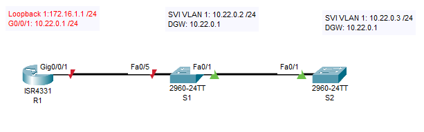
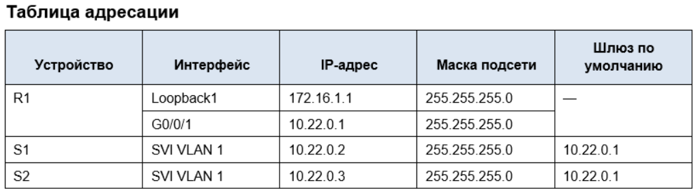
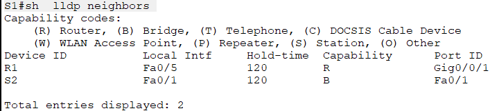
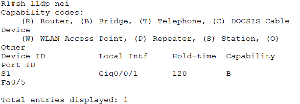
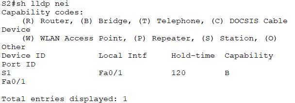

# Лабораторная работа - Настройка протоколов CDP, LLDP и NTP
### Топология

## Задачи
## Часть 1. Создание сети и настройка основных параметров устройства
## Часть 2. Обнаружение сетевых ресурсов с помощью протокола CDP
## Часть 3. Обнаружение сетевых ресурсов с помощью протокола LLDP
## Часть 4. Настройка и проверка NTP
#### Общие сведения/сценарий
##### Протокол Cisco Discovery Protocol (CDP) — собственный протокол Cisco для обнаружения сетевых ресурсов, функционирующий на канальном уровне. Он служит для обмена информацией, например именами устройств и версиями ПО IOS, с другими физически подключенными устройствами Cisco. Протокол Link Layer Discovery Protocol (LLDP) — это не зависящий от производителя протокол для обнаружения сетевых ресурсов, функционирующий на канальном уровне. В основном он используется сетевыми устройствами в локальной сети (LAN). Сетевые устройства сообщают соседям такие данные о себе, как идентификаторы и сведения о функциональных возможностях.
##### Протокол сетевого времени (NTP) служит для синхронизации времени между распределенными серверами времени и клиентами. В качестве транспортного протокола NTP использует протокол UDP. Все операции обмена данными по протоколу NTP выполняются по времени в формате UTC.
##### Cервер NTP обычно получает данные о времени из достоверного источника, такого как атомные часы, к которым подключен сервер. Затем он распределяет это время по сети. Протокол NTP чрезвычайно эффективен; для синхронизации времени на двух компьютерах с временной разницей в пределах миллисекунды требуется отправлять не более одного пакета в минуту.
##### В этой лабораторной работе вам предстоит задокументировать порты, которые используются для подключения к другим коммутаторам по протоколам CDP и LLDP. Полученные результаты следует указать в диаграмме сетевой топологии.
## Часть 1. Создание сети и настройка основных параметров устройства
### Шаг 1. Создайте сеть согласно топологии.
### Шаг 2. Настройте базовые параметры для маршрутизатора.
#### a.	Назначьте маршрутизатору имя устройства.
#### b.	Отключите поиск DNS, чтобы предотвратить попытки маршрутизатора неверно преобразовывать введенные команды таким образом, как будто они являются именами узлов.
#### c.	Назначьте class в качестве зашифрованного пароля привилегированного режима EXEC.
#### d.	Назначьте cisco в качестве пароля консоли и включите вход в систему по паролю.
#### e.	Назначьте cisco в качестве пароля VTY и включите вход в систему по паролю.
#### f.	Зашифруйте открытые пароли.
#### g.	Создайте баннер с предупреждением о запрете несанкционированного доступа к устройству.
#### h.	Настройка интерфейсов, перечисленных в таблице выше
#### i.	Сохраните текущую конфигурацию в файл загрузочной конфигурации.
### Шаг 3. Настройте базовые параметры каждого коммутатора.
#### a.	Присвойте коммутатору имя устройства.
#### b.	Отключите поиск DNS, чтобы предотвратить попытки маршрутизатора неверно преобразовывать введенные команды таким образом, как будто они являются именами узлов.
#### c.	Назначьте class в качестве зашифрованного пароля привилегированного режима EXEC.
#### d.	Назначьте cisco в качестве пароля консоли и включите вход в систему по паролю.
#### e.	Назначьте cisco в качестве пароля VTY и включите вход в систему по паролю.
#### f.	Зашифруйте открытые пароли.
#### g.	Создайте баннер, который предупреждает всех, кто обращается к устройству, видит баннерное сообщение «Только авторизованные пользователи!».  
#### h.	Отключите неиспользуемые интерфейсы
#### i.	Сохраните текущую конфигурацию в файл загрузочной конфигурации.
### Итоговые конфигурации сетевого оборудования после выполнения шагов 1-3:
##### Дополнительно на S1 и S2 необходимо настроить адрес шлюза по умолчанию (192.168.1.1) выполнением команды:
###### ip default-gateway 192.168.1.1
#### [Конфигурация R1 после всех настроек](ConfR1)
#### [Конфигурация S1 после всех настроек](ConfS1)
#### [Конфигурация S2 после всех настроек](ConfS2)
## Часть 2. Обнаружение сетевых ресурсов с помощью протокола CDP
##### На устройствах Cisco протокол CDP включен по умолчанию. Воспользуйтесь CDP, чтобы обнаружить порты, к которым подключены кабели.
##### Откройте окно конфигурации
#### a.	На R1 используйте соответствующую команду show cdp, чтобы определить, сколько интерфейсов включено CDP, сколько из них включено и сколько отключено.
##### Результат выполнения команды sh cdp int:
###### R1#sh cdp int
###### Vlan1 is administratively down, line protocol is down
######   Sending CDP packets every 60 seconds
######   Holdtime is 180 seconds
###### GigabitEthernet0/0/0 is administratively down, line protocol is down
######   Sending CDP packets every 60 seconds
######   Holdtime is 180 seconds
###### GigabitEthernet0/0/1 is up, line protocol is up
######   Sending CDP packets every 60 seconds
######   Holdtime is 180 seconds
###### GigabitEthernet0/0/2 is administratively down, line protocol is down
######   Sending CDP packets every 60 seconds
######   Holdtime is 180 seconds
#####  CDP включен на всех интерфейсах. Интерфейсы Vlan 1, G0/0/0, G0/0/2 выключены, находятся в состоянии - administratively down.
#### b.	На R1 используйте соответствующую команду show cdp, чтобы определить версию IOS, используемую на S1.
##### Результат выполнения команды sh cdp entry S1:
######  R1#sh cdp entry S1

######  Device ID: S1
######  Entry address(es): 
######   IP address : 10.22.0.2
######  Platform: cisco 2960, Capabilities: Switch
######  Interface: GigabitEthernet0/0/1, Port ID (outgoing port): FastEthernet0/5
######  Holdtime: 138
######  
######  Version :
######  Cisco IOS Software, C2960 Software (C2960-LANBASEK9-M), Version 15.0(2)SE4, RELEASE SOFTWARE (fc1)
######  Technical Support: http://www.cisco.com/techsupport
######  Copyright (c) 1986-2013 by Cisco Systems, Inc.
######  Compiled Wed 26-Jun-13 02:49 by mnguyen
######  
######  advertisement version: 2
######  Duplex: full
####  Версия IOS на S1: Version 15.0(2)SE4
#### c.	На S1 используйте соответствующую команду show cdp, чтобы определить, сколько пакетов CDP было выданных- не поддерживается в СРТ.
#### d.	Настройте SVI для VLAN 1 на S1 и S2, используя IP-адреса, указанные в таблице адресации выше. Настройте шлюз по умолчанию для каждого коммутатора на основе таблицы адресов-выполнены при первоначальной настройке, см. итоговые конф-ии в Часть 1, Шаг 3.
#### e.	На R1 выполните команду show cdp entry S1. 
##### Какие дополнительные сведения доступны?
##### Доступна информация об IP-адресе SVI (10.22.0.2), IP-адресе управления (10.22.0.2)
#### f.	Отключить CDP глобально на всех устройствах. 
##### Для отключения CDP на всех интерфейсах необходимо на каждом устройстве в режиме глобальной конфигурации выполнить команду "no cdp run"
## Часть 3. Обнаружение сетевых ресурсов с помощью протокола LLDP
##### На устройствах Cisco протокол LLDP может быть включен по умолчанию. Воспользуйтесь LLDP, чтобы обнаружить порты, к которым подключены кабели.
#### a.	Введите соответствующую команду lldp, чтобы включить LLDP на всех устройствах в топологии.
##### Для включения LLDP на всех интерфейсах необходимо на каждом устройстве в режиме глобальной конфигурации выполнить команду "lldp run"
#### b.	На S1 выполните соответствующую команду lldp, чтобы предоставить подробную информацию о S2. 
#### S1# show lldp entry S2 - не поддерживается в CPT.
##### Возпользуемся командой S1#sh  lldp neighbors, результат выполнения на S1:

#### Что такое chassis ID  для коммутатора S2?
#### В LLDP это Идентификатор шасси. При настройке этого параметра также возможно указания MAC-адреса устройства.
#### c.	Соединитесь через консоль на всех устройствах и используйте команды LLDP, необходимые для отображения топологии физической сети только из выходных данных команды show.
##### Результат выполнения команды sh  lldp neighbors на R1:

##### Результат выполнения команды sh  lldp neighbors на S2:

##### На примере вывода для R1: Отображается устройство подключеннное к порту Gig0/0/1 маршрутизатора - коммутатор S1, отображается номер порта подключения на коммутаторе S1 -это порт F0/5, отображается тип устройства - B это коммутатор.
## Часть 4. Настройка NTP
##### В части 4 необходимо настроить маршрутизатор R1 в качестве сервера NTP, а коммутатора S1 в качестве клиента NTP маршрутизатора R1. Необходимо выполнить синхронизацию времени для Syslog и отладочных функций. Если время не синхронизировано, сложно определить, какое сетевое событие стало причиной данного сообщения.
### Шаг 1. Выведите на экран текущее время.
##### Откройте окно конфигурации
##### Введите команду show clock для отображения текущего времени на R1. Запишите отображаемые сведения о текущем времени в следующей таблице.
##### В выводе выполнения команды show clock detail присутствует информации об источнике настройки времени: Time source is hardware calendar
##### Т.е. время и дата определены настройкой по умолчанию в конфигурации устройства.

### Шаг 2. Установите время.
##### С помощью команды clock set установите время на маршрутизаторе R1. Введенное время должно быть в формате UTC. 
###### R1#clock set 16:16:16 14 dec 2025
### Шаг 3. Настройте главный сервер NTP.
#### Настройте R1 в качестве хозяина NTP с уровнем слоя 4.
##### Выполнение команд на R1(config)#ntp master 4 и  ntp update-calendar
### Шаг 4. Настройте клиент NTP.
### a.	Выполните соответствующую команду на S1 и S2, чтобы просмотреть настроенное время. Запишите текущее время,  в следующей таблице. Необходимо выполнить команду sh clock. В результате выполнения получаем информацию, что время не настроено по аналогии с маршрутизатором R1.

### b.	Настройте S1 и S2 в качестве клиентов NTP. Используйте соответствующие команды NTP для получения времени от интерфейса G0/0/1 R1, а также для периодического обновления календаря или аппаратных часов коммутатора.
##### На коммутаторах S1 и S2 внеобходимо выполнить команду: ntp server 10.22.0.1
### Шаг 5. Проверьте настройку NTP.
### a.	Используйте соответствующую команду show , чтобы убедиться, что S1 и S2 синхронизированы с R1.
##### Примечание. Синхронизация метки времени на маршрутизаторе R2 с меткой времени на маршрутизаторе R1 может занять несколько минут.

### b.	Выполните соответствующую команду на S1 и S2, чтобы просмотреть настроенное время и сравнить ранее записанное время.
