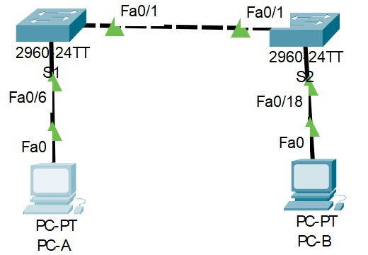

# Занятие 5: Канальный уровень. Ethernet

#### Цели
* Часть 1. Создание и настройка сети
* Часть 2. Изучение таблицы МАС-адресов коммутатора

# Часть 1 Создание и настройка сети
#### Топология 1:

#### Таблица адресации

| Устройство  |  Интерфейс |  IP-адрес | Маска подсети  |
| :------------ | :------------ | :------------ | :------------ |
|  S1 | VLAN 1|192.168.1.11|255.255.255.0|
| S2|VLAN 1|192.168.1.12|255.255.255.0|
|PC-A|NIC|192.168.1.1|255.255.255.0|
|PC-B|NIC|192.168.1.2|255.255.255.0|
