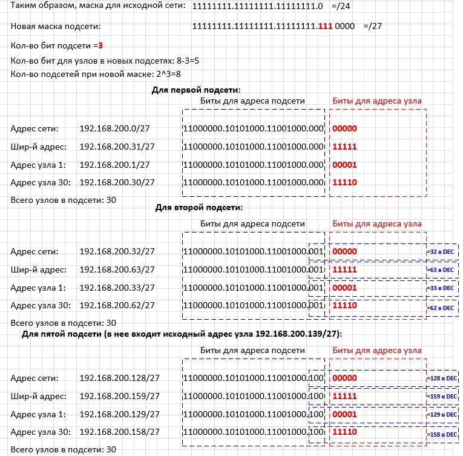

# Занятие 9: Лабораторная работа-Расчет подсетей IPv4

### Задачи
* Часть 1. Определение подсетей по IPv4-адресу
* Часть 2. Расчет подсетей по IPv4-адресу

### Задание 1:

| Дано: | |
| :------------ | :------------ |
| IP-адрес узла: | 192.168.200.139 |
| Исходная маска подсети: | 255.255.255.0 |
| Новая маска подсети: | 255.255.255.224 |

#### Пример расчетов:

#### Таблица итоговых значений

| Найти: | |
| :------------ | :------------ |
| Количество бит подсети: | 3 |
| Количество созданных подсетей: | 8 |
| Количество бит узлов в подсети: | 5 |
| Количество узлов в подсети: | 30 |
| Сетевой адрес этой подсети: | 192.168.200.128 /27 |
| IPv4-адрес первого узла в этой подсети: | 192.168.200.129 /27 |
| IPv4-адрес последнего узла в этой подсети: | 192.168.200.158 /27 |
| Широковещательный IPv4-адрес в этой подсети: | 192.168.200.159 /27 |
